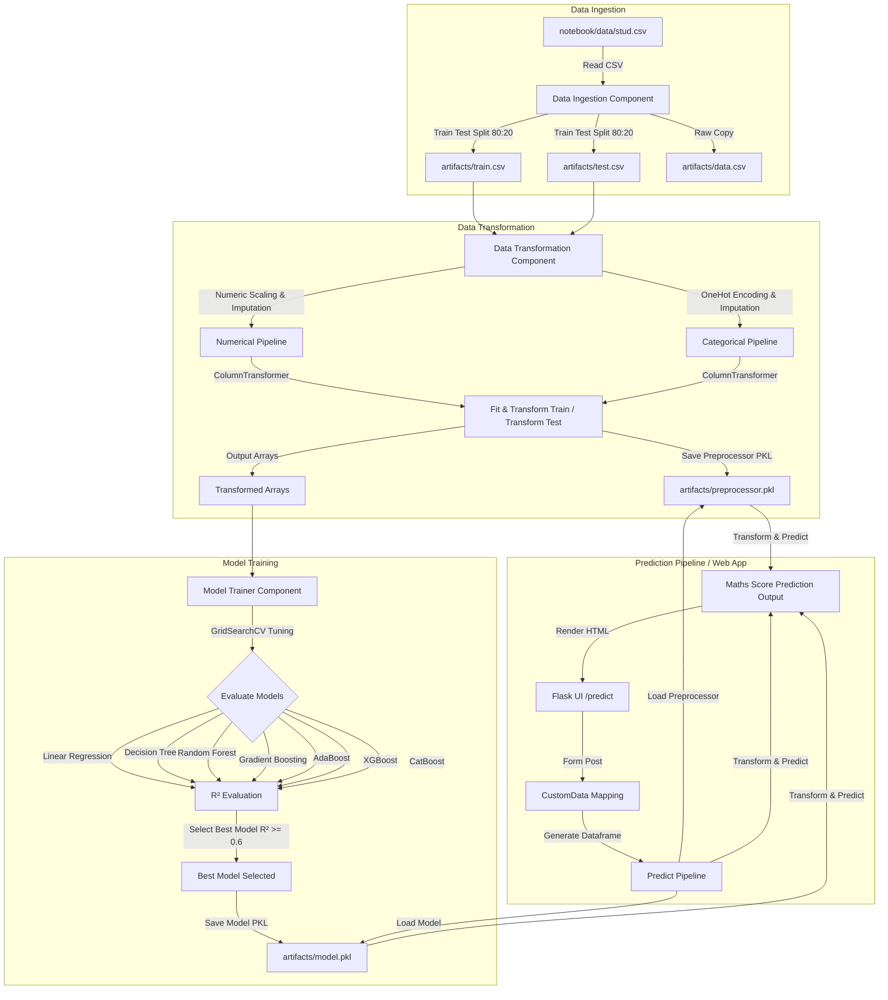

# Student Exam Performance Indicator (Score Checker)

An End-to-End Machine Learning project that predicts a student's **Maths Score** based on demographic and academic indicators (such as Gender, Ethnicity, Parental Level of Education, Lunch type, Test Preparation Course, Reading Score, and Writing Score).

This repository covers the complete life cycle of an ML project: Exploratory Data Analysis (EDA), Data Ingestion, Data Transformation, Model Training & Hyperparameter Tuning, custom Logging & Exception Handling, and deployment as a Flask Web Application ready for AWS Elastic Beanstalk.

---

## 📊 Dataset Overview
The dataset contains performance details of students, including the following features:
- **gender**: Gender of the student (`male`/`female`)
- **race_ethnicity**: Race/ethnicity group (`group A`, `group B`, `group C`, `group D`, `group E`)
- **parental_level_of_education**: Parent's highest education level (`some high school`, `high school`, `some college`, `associate's degree`, `bachelor's degree`, `master's degree`)
- **lunch**: Lunch type (`standard` or `free/reduced`)
- **test_preparation_course**: Prep course completion (`none` or `completed`)
- **reading_score**: Score obtained in reading (0 - 100)
- **writing_score**: Score obtained in writing (0 - 100)
- **Target Feature -> math_score**: Score obtained in mathematics (0 - 100)

---

## 🛠️ Project Architecture & Workflow



---

## 📁 Directory Structure

```text
├── .ebextensions/
│   └── python.config          # WSGI configuration for AWS Elastic Beanstalk
├── artifacts/                 # Generated datasets, preprocessor, and model pickle files (after running ingestion)
├── notebook/
│   ├── data/
│   │   └── stud.csv           # Source raw dataset
│   ├── 1. EDA_STUDENT_PERFORMANCE.ipynb  # Jupyter notebook for Exploratory Data Analysis
│   └── 2.MODEL_TRAINING.ipynb            # Jupyter notebook for initial model experiments
├── src/                       # Core python package source code
│   ├── components/
│   │   ├── __init__.py
│   │   ├── data_ingestion.py       # Reads dataset, creates splits, and saves artifacts
│   │   ├── data_transformation.py  # Builds Pipelines, handles Scaling, Imputing, Encoding
│   │   └── model_trainer.py        # Evaluates multiple regressor models and saves the best model
│   ├── pipeline/
│   │   ├── __init__.py
│   │   ├── predict_pipeline.py     # End-to-end inference/prediction logic
│   │   └── train_pipeline.py       # (Placeholder) Pipeline for retraining
│   ├── __init__.py
│   ├── exception.py           # Custom exception handler with file/line traceback
│   ├── logger.py              # Logging setup with timestamped logs
│   └── utils.py               # Shared utility functions (saving/loading models, evaluation)
├── templates/
│   ├── home.html              # Frontend user input form for predictions
│   └── index.html             # Basic home landing page
├── application.py             # Flask Web Application entry point (designed for Beanstalk)
├── requirements.txt           # Project dependencies
├── setup.py                   # Setuptools packaging script
└── README.md                  # Project Documentation
```

---

## ⚡ Setup & Execution Instructions

Follow these steps to set up and run this project locally:

### 1. Prerequisites & Installation
Ensure you have Python installed (Python 3.8+ recommended).

Clone the repository and navigate into the root directory:
```bash
git clone https://github.com/Jerry-britto/Student-Score-Checker
cd Student-Score-Checker
```

Create and activate a virtual environment:
```bash
# Windows
python -m venv venv
venv\Scripts\activate

# Linux/macOS
python3 -m venv venv
source venv/bin/activate
```

Install the dependencies:
```bash
pip install -r requirements.txt
```

*(Optional)* Install the package locally:
```bash
pip install -e .
```

---

### 2. Run the Machine Learning Pipeline
To run the end-to-end pipeline (Data Ingestion ➡️ Data Transformation ➡️ Model Training & Evaluation):
```bash
python3 src/components/data_ingestion.py
```
Upon successful completion, this will:
1. Split the data and save `train.csv`, `test.csv`, and `data.csv` in the `artifacts/` folder.
2. Fit the preprocessors and save `preprocessor.pkl` in `artifacts/`.
3. Train all models, perform grid search, output the best model name and R² score, and save the best model as `model.pkl` in `artifacts/`.

---

### 3. Run the Web Application
Start the Flask development server:
```bash
python3 application.py
```
Open your browser and navigate to:
* **Home Page**: [http://127.0.0.1:5000/](http://127.0.0.1:5000/)
* **Prediction Form**: [http://127.0.0.1:5000/predict](http://127.0.0.1:5000/predict)

---

## 📈 Model Performance & Tuning
The `ModelTrainer` component evaluates the following regressor models using R² score on the test dataset:
- **Decision Tree Regressor**
- **Random Forest Regressor**
- **Gradient Boosting Regressor**
- **Linear Regression**
- **XGBRegressor**
- **CatBoost Regressor**
- **AdaBoost Regressor**

Hyperparameter tuning is automated using 3-fold cross-validated Grid Search (`GridSearchCV`) for each model. The model that achieves the highest R² score is saved to `artifacts/model.pkl` (provided the score exceeds the threshold of `0.6`).

---

## 🌐 Deployment (AWS Elastic Beanstalk)
This application includes the configuration required for AWS Elastic Beanstalk deployment:
- Entry point file is named `application.py` and declares the WSGI entrypoint as `application = Flask(__name__)`.
- `.ebextensions/python.config` maps the WSGI path properly so AWS can run the application container correctly:
  ```yaml
  option_settings:
      "aws:elasticbeanstalk:container:python":
          WSGIPath: application:application
  ```

---

## 🛡️ Logging & Exception Handling
- **Custom Logging**: All events are logged inside the `logs/` directory. Each session generates a unique log file named with the current timestamp (e.g. `06_07_2026_14_49_22.log`).
- **Custom Exception Handling**: Any crash or error triggers the `CustomException` class defined in `src/exception.py`. It outputs the script name, exact line number, and error message to help identify and debug issues quickly.